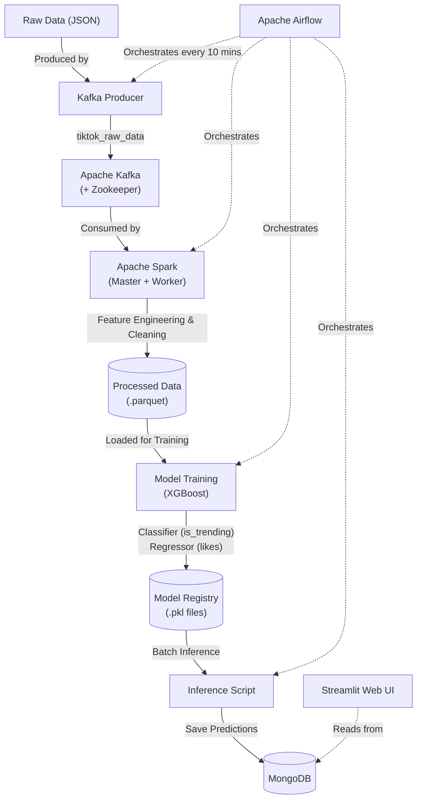

## What Was Built

An automated **End-to-End Big Data & Machine Learning Pipeline** designed to ingest TikTok video metadata, extract multimodal features (Vision & NLP), and predict whether a video will become a trend (and estimate its engagement). The entire lifecycle—from data streaming to model retraining and inference—is fully containerized and orchestrated by a state machine.

## Architecture

## Tech Stack

*   **Orchestration & Scheduling:** Apache Airflow (CeleryExecutor)
*   **Message Broker / Streaming:** Apache Kafka, Apache Zookeeper
*   **Distributed Data Processing:** Apache Spark (PySpark - Master & Worker nodes)
*   **Databases:** 
    *   PostgreSQL (Airflow Metadata)
    *   MongoDB (Storing Inference & Prediction Results)
    *   Redis (Airflow Celery Broker)
*   **Machine Learning / AI Algorithms:**
    *   **XGBoost:** `XGBClassifier` for predicting trend probability, `XGBRegressor` for predicting likes/engagement.
    *   **Computer Vision (CV):** `YOLOv8` (Ultralytics) for object detection (detecting persons and specific products), `OpenCV` (Haar Cascades) for facial ratio and close-up detection.
    *   **Natural Language Processing (NLP):** `PhoBERT` (HuggingFace Transformers) for generating deep text embeddings of Vietnamese captions, and `wonrax/phobert-base-vietnamese-sentiment` for sentiment analysis.
*   **Data Formats & Storage:** Parquet (for efficient columnar data storage during ML training), JSON.
*   **Infrastructure & DevOps:** Docker, Docker Compose (Multi-container architecture with custom networking and volume mounts).
*   **Web Application (Frontend):** Streamlit

## Key Features & Things Done

### 1. Robust Distributed Pipeline Setup
*   Configured a robust multi-container **Docker Compose** environment containing 11+ services (Airflow Webserver/Scheduler/Worker, Spark Master/Worker, Kafka, Zookeeper, Postgres, Mongo, Redis, Streamlit).
*   Built an **Airflow DAG** (`tiktok_streaming_lifecycle`) that runs every 10 minutes to manage the continuous streaming, processing, and auto-retraining lifecycle.

### 2. High-Throughput Data Ingestion
*   Developed a **Kafka Producer** to stream raw TikTok scraped data (JSON) into a Kafka topic (`tiktok_raw_data`).
*   Developed a **Spark Consumer** (`spark_processor.py`) that reads directly from the Kafka topic using PySpark structured streaming, parses the JSON payloads, performs data cleaning, and efficiently saves the output as `.parquet` files for model consumption.

### 3. Advanced Multimodal Feature Engineering
Designed a heavy-duty feature engineering pipeline (`feature_engineering_pipeline.py`) handling multimodal inputs:
*   **Temporal & Meta Features:** Calculated video lifespan, upload/crawl time deltas, and parsed hashtag metadata to identify trend-specific keywords.
*   **Visual Processing (YOLO + OpenCV):** Extracted frames using `cv2.VideoCapture`. Deployed a local `YOLOv8` model to detect the presence of humans and specific product categories (Ads). Used OpenCV's Haarcascades to calculate the screen real-estate occupied by human faces (`face_ratio`) to determine close-up shots.
*   **NLP Processing (Transformers):** Truncated and tokenized Vietnamese captions to extract 768-dimensional text embeddings using `vinai/phobert-base`, and derived sentiment scores using a fine-tuned sequence classification PhoBERT model.

### 4. Automated Machine Learning (Auto-Retrain)
*   Implemented `train_model.py` which dynamically loads the latest `.parquet` features dumped by Spark.
*   Trained an **XGBoost Classifier** to predict the binary target `is_trending` (using LogLoss).
*   Trained an **XGBoost Regressor** to predict the continuous variable `stats_likes` (Engagement).
*   Serialized and saved the retrained models using `joblib` into a shared Docker volume `/opt/airflow/models` where the Inference and UI layers can instantly access the updated weights.

### 5. Serving & Inference
*   Built an inference script to generate predictions on unseen data and push the enriched results to a **MongoDB** instance.
*   Set up a **Streamlit** container designed to connect to MongoDB and present the trends and predictions in a user-friendly web interface.
